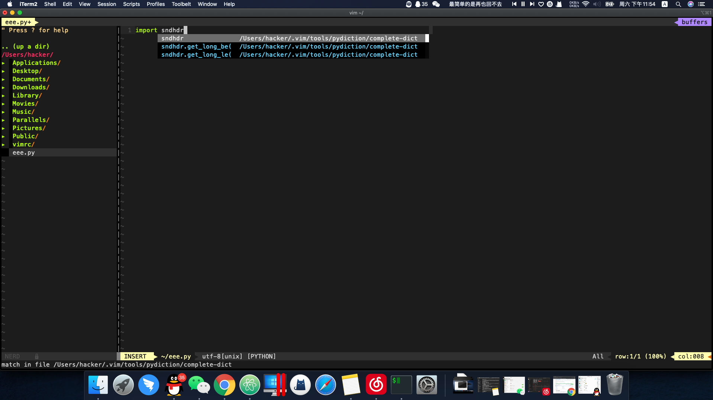
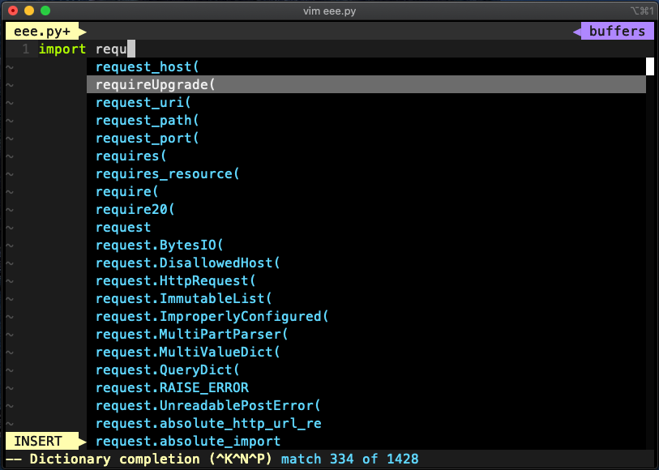

# Vimrc

## 支持开发语言：
```
C
C++
Python
```
## 一键安装
```
bash <(curl https://github.com/HexChristmas/vimrc/raw/master/autoinstall.sh -L)
```
## 添加MarkdownPreview
```
sudo npm -g install instant-markdown-d
```
## 快捷键
```
\cc 注释光标所在行
\ci 切换突出显示的行的状态
\cu 取消注释光标突出显示的行
\cs 使用/ *和* /而不是普通的//注释突出显示的内容
```



